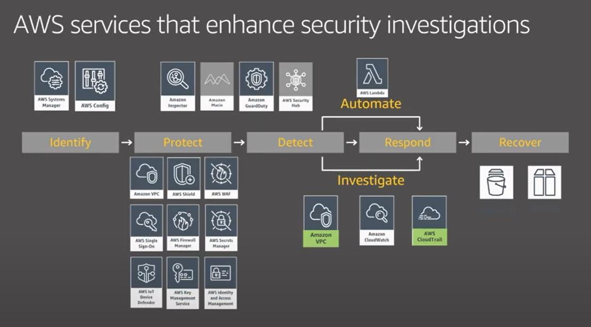

# セキュリティ
AWS には責任共有モデルという考え方がある。  
AWS が責任をもってセキュリティを担保するエリアと、AWS 契約者(貴社)がセキュリティを導入しなければならないエリアが明確に定義されている。  
このモデルに従って設計を行なっていくことが前提にある。  

## 要件

## ネットワークセキュリティ
送信元と送信先の必要な通信のみを許可するようトラフィックをコントールする。  

### セキュリティグループによるアクセスコントロール
各リソース間のアクセス制限にはセキュリティグループを利用しトラフィックを制限する。  
原則としてセキュリティグループによるアクセスコントールを行う。  

### ネットワークACLによるアクセスコントロール
サブネット単位でベースラインとなるポリシーを設定する場合にはネットワークACLを適用する。  
サブネット間の通信コントロールを行う場合はネットワーク ACL を検討する。  

## 論理アクセス
論理アクセスは基準を設け、例外なく遵守する。  

### 本システム上の職責
システムの開発・構築・運用を行うにあたり、職責に合わせた権限管理を導入する。  

|職責名|アクセス権限|IAM グループ名|
|---|---|---|
|クラウド管理者|AWS アカウントに関する全ての操作権限を持つ。 最低2名に割り当てる。通常は使用しない。|Administrators|
|インフラ管理者|システムに必要な AWS リソースの作成・削除・変更権限を持つ。ただし、IAM 関連とセキュリティ関連は読み取りのみ。|InfraAdmins|
|セキュリティ管理者|コンプライアンス監査、セキュリティ分析、変更管理などセキュリティに関わる権限を持つ。|SecurityAdmins|
|IAM 管理者|IAM ユーザー・グループ・ロールの作成や削除、IAM ポリシーの変更権限を持つ。|IAMAdmins|
|アプリケーション開発者|アプリケーション開発に必要なリソース操作権限を持つ。アプリケーションごとに IAM グループを作成する。|～～Apps|
|オペレーター|システム運用を行うための操作権限を持つ。|Operators|

### IAMユーザー/グループ/ポリシー/ロール
AWS リソースへのアクセスコントールは IAM で行う。  

* IAM ユーザー：AWS 操作用のユーザー
* IAM グループ：IAM ユーザーをまとめるグループ
* IAM ポリシー：AWS のサービスの操作に対する権限設定、IAM ユーザーや IAM グループ、IAM ロールに対して付与する
* IAM ロール：AWS アカウント上の役割を定義したもの

AWS リソースの操作が必要なメンバー1人つき1つの IAM ユーザーを発行する。  
プログラム用の IAM ユーザーもプログラムにつき1つの IAM ユーザーを発行する。  
共用ユーザーや1つの IAM ユーザーを複数人で使うことは禁止とする。  

プロジェクト上の職責に応じた IAM グループを作成する。  
その IAM グループに必要最低限の権限を記述した IAM ポリシーをアタッチする。  
IAM ユーザーは IAM グループに所属させる。  
これを IAM の大原則とする。  

ただし、プログラムによる API アクセスの場合は例外として IAM ユーザーに IAM ポリシーをアタッチすることを許容する。  

### IAM ユーザーパスワードポリシー
AWS マネジメントコンソールにログインするために必要となるパスワードには以下のポリシーを設定可能。  

|項目|設定値|
|---|---|
|パスワードの最小文字数を強制する|14|
|1 文字以上のアルファベット大文字 (A～Z) を必要とする|オン|
|1 文字以上のアルファベット小文字 (a～z) を必要とする|オン|
|少なくとも 1 つの数字が必要|オン|
|少なくとも 1 つの英数字以外の文字が必要 (!@#$%^&*()_+-=[]{}\|')|オン|
|パスワードの有効期限を有効にする|オフ|
|パスワードの有効期限には管理者のリセットが必要|オフ|
|ユーザーにパスワードの変更を許可する|オン|
|パスワードの再利用を禁止する|オン|

### ログイン時のMFA利用 
AWS マネジメントコンソールへのログイン時には MFA を利用する。  
ログイン時の MFA を強制する、もしくは、MFA 無しのログインでは権限無し/ReadOnly にするなどの処置を導入する。  

サポートされているアプリケーションリストは AWS 公式を参照。  
[Multi-factor Authentication](https://aws.amazon.com/jp/iam/features/mfa/?audit=2019q1)  

### ルートアカウント
AWS 契約時に払い出されるルートアカウントは使用しない。  
ルートアカウントは MFA で保護し、パスワードを知る者、MFA を管理する者を別の人間とし、厳重に保護する。  

### IAM ユーザーアクセスキー
アクセスキーを発行した場合は、定期的にローテーションを行う。  

また、アクセスキーは極力テキストファイルで保存することは避ける。  
GitHub、EC2 上、AMI 上、プロジェクトで作成したドキュメント、メールでの保管はしない。  

## データ暗号化
通信中のデータ、保管中のデータを暗号化することでデータを保護する。  

### 通信の暗号化
リソース間の通信は最新の暗号化プロトコルを用いて暗号化する。  
外部システムとの連携で、連携先の都合により暗号化プロトコルが使用できない場合でも閉域網の利用など代替案を検討すること。  

リソース間通信と暗号化の関係は以下の通り。  

|From|To|暗号化|
|---|---|---|
|VPC 内リソース|VPC 内リソース|可能な限り暗号化、通信保護が担保されていれば非暗号も許容する|
|VPC 内リソース|VPC 外の AWS リソース|暗号化を実施|
|VPC 外の AWS リソース|VPC 内リソース|暗号化を実施|
|AWS リソース|AWS 外リソース|暗号化を実施、外部システムの都合により暗号化できない場合は個別に対策をとる|
|AWS 外リソース|AWS リソース|暗号化を実施、外部システムの都合により暗号化できない場合は個別に対策をとる|

### 保管データの暗号化
AWS リソース上に保管するデータは常に暗号化を行う。  
暗号化の方式は2つあり何れかを選択する。  

* AWS の機能を利用して暗号化 (サーバーサイド)
* アプリケーションでデータを生成する際に暗号化 (クライアントサイド)

## ウィルス/マルウェア対策
EC2 にはウィルス/マルウェア対策ソフトウェアを導入する。  
ウィルス/マルウェア対策ソフトウェアでは以下の基本ポリシーで EC2 を保護する。  

|モジュール|オン/オフ|備考|
|---|---|---|
|不正プログラム対策|オン|リアルタイム|
|Web レピュテーション|オフ|用途に応じて使用する|
|ファイアウォール|オフ|SecurityGroup に集約|
|侵入防御|オン|初期は検出モードでチューニングを実施|
|変更監視|オン|監視するディレクトリを指定する|
|セキュリティログ監視|オン||

## セキュリティを強化する AWS サービス
`Identify(同一性保持) → Protect(防御) → Detect(検知) → Investigate(調査)・Respond(対応) → Recover(復旧)`  

  

### Config(Identify)
[構成管理](cloud-design-configurationmanagement.md) に記載。  

### 脆弱性チェック(Protect)
コンピュートリソースに対して脆弱性のチェックを行う。  
システムを堅牢に保つために脆弱性チェックは定期的に行う。  

#### EC2
EC2 は  Inspector で脆弱性チェックを行う。  
Inspectorでチェックする脆弱性は以下の通り。  

|ルール|説明|
|---|---|
|共通脆弱性識別子|EC2 instances が共通脆弱性識別子 (CVE) にさらされているかのチェックを行う。|
|CIS ベンチマーク|業界標準のベストプラクティスでサーバー設定を評価する。|
|ネットワーク到達可能性|ネットワーク設定を分析し管理が誤っているセキュリティグループ、ACL、IGW など、潜在的に悪意のあるアクセスを許可するネットワーク設定をハイライトする。|
|セキュリティのベストプラクティス|Linux または Windows 設定の安全性をチェックする。|

各ルールの詳細は AWS ドキュメントに記載がある。  
[Amazon Inspector のルール パッケージとルール](https://docs.aws.amazon.com/ja_jp/inspector/latest/userguide/inspector_rule-packages.html)

#### ECR
ECR リポジトリにプッシュされたイメージに対してスキャンを実施する。  

スキャンの詳細は AWS ドキュメントに記載がある。  
[イメージスキャン](https://docs.aws.amazon.com/ja_jp/AmazonECR/latest/userguide/image-scanning.html)

### パッチ運用(Protect)
不正アクセスや不正プログラムからシステムを保護するためOSセキュリティパッチを適用する。  

初めに検証環境でパッチ適用し影響を調査する。  
問題が無いことを確認してから本番環境へ適用する。  

パッチ実行は Systems Manager を使って一斉適用をする。  
OS 上のパッチ適用自動設定は無効にしておく。  

### GuardDuty(Detect)
GuardDuty のよって AWS 環境内のネットワークアクティビティとアカウントの動作を継続的にモニタリングし、脅威を検出する。  
GuardDuty は CloudTrail、VPC フローログ、DNS ログを分析して継続的に驚異を検出する。  
検出した脅威は管理者へ通知する。  

GuarDuty が検出する脅威の詳細は AWS ドキュメントに記載がある。  
[アクティブな結果タイプ](https://docs.aws.amazon.com/ja_jp/guardduty/latest/ug/guardduty_finding-types-active.html)

### Security Hub(Detect)
Security Hub によって AWS アカウントのセキュリティチェックを自動的に行う。  
セキュリティチェックの結果を定期的にレビュー、または、変更の都度レビューを行い違反している項目は対策を講じる。  

AWS が提供している標準のコンプライアンスコントロールを使用する。  
提供されているルールのうち、社内セキュリティポリシーに合致しないものは無効にしておく。  

#### CIS AWS Foundations
CIS が公開している以下の基準を満たしているかをチェックする。  
一部システマティックにチェックできない [項目](https://docs.aws.amazon.com/ja_jp/securityhub/latest/userguide/securityhub-standards-cis-checks-not-supported.html) がある。それらは人間的なチェックスを行う。  

* CIS Amazon Web Services Foundations Benchmark 用の CIS Benchmark for CIS、v1.2.0、レベル 1
* CIS Amazon Web Services Foundations Benchmark 用の CIS ベンチマーク、v1.2.0、レベル 2

CIS AWS Foundations に含まれるチェック項目と修復方法は公式ドキュメントに記載がある。  
[CIS AWS Foundations のコントロール](https://docs.aws.amazon.com/ja_jp/securityhub/latest/userguide/securityhub-cis-controls.html)  

#### Payment Card Industry Data Security Standard (PCI DSS)
PCI DSS 準拠のための対策ができているかをチェックする。  
Security Hub での合格なったからといって PCI DSS 評価合格とはならないことは留意する。  

PCI DSS コントロールに含まれるチェック項目と修復方法は公式ドキュメントに記載がある。  
[PCI DSS コントロール](https://docs.aws.amazon.com/ja_jp/securityhub/latest/userguide/securityhub-pci-controls.html)

#### AWS の基本的なセキュリティのベストプラクティス
基本的なセキュリティ対策に対するチェックを行う。  

このコントロールに含まれるチェック項目と修復方法は公式ドキュメントに記載がある。  
[AWS の基本的なセキュリティのベストプラクティスコントロール](https://docs.aws.amazon.com/ja_jp/securityhub/latest/userguide/securityhub-standards-fsbp-controls.html)

### 操作証跡(Investigate)
AWS リソースに対するアクティビティと API 使用は CloudTrail で追跡する。  
ユーザー、ロール、または AWS のサービスによって実行されたアクションは、CloudTrail にイベントとして記録される。  

CloudTrail の証跡情報は S3 と CloudWatch Logs へ保存する。  
3 へ保存する際にログファイルの検証を有効にし、かつ、  
ログファイルを保存する S3 バケットのサーバーアクセスログ記録を有効にし、改ざんが行われていないことを証明する。  

#### 不正と疑われる操作の通知
以下の操作が行われた際には、不正が疑われる操作として管理者へ通知する。  

* セキュリティグループの作成、更新、削除
* EC2 インスタンスの作成、終了、起動、停止、再起動
* サイズの大きい EC2 インスタンス (4x or 8x-large) の作成、終了、起動、停止、再起動
* IAM ポリシーの変更
* 許可されていない API の実行
* AWS マネジメントコンソールへのログイン失敗
* VPC または VPC peering の作成、更新、削除
* Internet Gateway または Customer Gateway の作成、更新、削除
* Network ACL の作成、更新、削除
* CloudTrail の作成、更新、削除、ロギングのスタート、ロギングのストップ
* S3 バケットポリシーの変更

この設定を自動で行うテンプレートが用意されており、テンプレート使用方法は AWS ドキュメントに記載がある。  
[AWS CloudFormation テンプレートを使用して CloudWatch アラームを作成する](https://docs.aws.amazon.com/ja_jp/awscloudtrail/latest/userguide/use-cloudformation-template-to-create-cloudwatch-alarms.html)  

